# Gas Town Architecture

Gas Town is a multi-agent workspace manager that coordinates AI coding agents working on software projects. It provides the infrastructure for running swarms of agents, managing their lifecycle, and coordinating their work through mail and issue tracking.

## System Overview

```mermaid
graph TB
    subgraph "Gas Town"
        Overseer["👤 Overseer<br/>(Human Operator)"]

        subgraph Town["Town (~/ai/)"]
            Mayor["🎩 Mayor<br/>(Global Coordinator)"]

            subgraph Rig1["Rig: wyvern"]
                W1["👁 Witness"]
                R1["🔧 Refinery"]
                P1["🐱 Polecat"]
                P2["🐱 Polecat"]
                P3["🐱 Polecat"]
            end

            subgraph Rig2["Rig: beads"]
                W2["👁 Witness"]
                R2["🔧 Refinery"]
                P4["🐱 Polecat"]
            end
        end
    end

    Overseer --> Mayor
    Mayor --> W1
    Mayor --> W2
    W1 --> P1
    W1 --> P2
    W1 --> P3
    W2 --> P4
    P1 -.-> R1
    P2 -.-> R1
    P3 -.-> R1
    P4 -.-> R2
```



## Core Concepts

### Town

A **Town** is a complete Gas Town installation - the workspace where everything lives. A town contains:
- Town configuration (`config/` directory)
- Mayor's home (`mayor/` directory at town level)
- One or more **Rigs** (managed project repositories)

### Rig

A **Rig** is a container directory for managing a project and its agents. Importantly, the rig itself is NOT a git clone - it's a pure container that holds:
- Rig configuration (`config.json`)
- Rig-level beads database (`.beads/`) for coordinating work
- Agent directories, each with their own git clone

This design prevents agent confusion: each agent has exactly one place to work (their own clone), with no ambiguous "rig root" that could tempt a lost agent.

### Overseer (Human Operator)

The **Overseer** is the human operator of Gas Town - not an AI agent, but the person who runs the system. The Overseer:

- **Sets strategy**: Defines project goals and priorities
- **Provisions resources**: Adds machines, polecats, and rigs
- **Reviews output**: Approves swarm results and merged code
- **Handles escalations**: Makes final decisions on stuck or ambiguous work
- **Operates the system**: Runs `gt` commands, monitors dashboards

The Mayor reports to the Overseer. When agents can't resolve issues, they escalate up through the chain: Polecat → Witness → Mayor → Overseer.

### Agents

Gas Town has four AI agent roles:

| Agent | Scope | Responsibility |
|-------|-------|----------------|
| **Mayor** | Town-wide | Global coordination, swarm dispatch, cross-rig decisions |
| **Witness** | Per-rig | Worker lifecycle, nudging, pre-kill verification, session cycling |
| **Refinery** | Per-rig | Merge queue processing, PR review, integration |
| **Polecat** | Per-rig | Implementation work on assigned issues |

### Mail

Agents communicate via **mail** - JSONL-based inboxes for asynchronous messaging. Each agent has an inbox at `mail/inbox.jsonl`. Mail enables:
- Work assignment (Mayor → Refinery → Polecat)
- Status reporting (Polecat → Witness → Mayor)
- Session handoff (Agent → Self for context cycling)
- Escalation (Witness → Mayor for stuck workers)

```mermaid
flowchart LR
    subgraph "Communication Flows"
        direction LR
        Mayor -->|"dispatch swarm"| Refinery
        Refinery -->|"assign work"| Polecat
        Polecat -->|"done signal"| Witness
        Witness -->|"swarm complete"| Mayor
        Witness -->|"escalation"| Mayor
        Mayor -->|"escalation"| Overseer["👤 Overseer"]
    end
```



### Beads

**Beads** is the issue tracking system. Gas Town agents use beads to:
- Track work items (`bd ready`, `bd list`)
- Create issues for discovered work (`bd create`)
- Claim and complete work (`bd update`, `bd close`)
- Sync state to git (`bd sync`)

Polecats have direct beads write access and file their own issues.

#### Beads Configuration for Multi-Agent

Gas Town uses beads in a **shared database** configuration where all agents in a rig share one `.beads/` directory. This requires careful configuration:

| Agent Type | BEADS_DIR | BEADS_NO_DAEMON | sync-branch | Notes |
|------------|-----------|-----------------|-------------|-------|
| Polecat (worktree) | rig/.beads | **YES (required)** | recommended | Daemon can't handle worktrees |
| Polecat (full clone) | rig/.beads | Optional | recommended | Daemon safe but sync-branch helps |
| Refinery | rig/.beads | No | optional | Owns main, daemon is fine |
| Witness | rig/.beads | No | optional | Read-mostly access |
| Mayor | rig/.beads | No | optional | Infrequent access |

**Critical: Worktrees require no-daemon mode.** The beads daemon doesn't know which branch each worktree has checked out, and can commit/push to the wrong branch.

**Environment setup when spawning agents:**

```bash
# For worktree polecats (REQUIRED)
export BEADS_DIR=/path/to/rig/.beads
export BEADS_NO_DAEMON=1

# For full-clone polecats (recommended)
export BEADS_DIR=/path/to/rig/.beads
# Daemon is safe, but consider sync-branch for coordination

# Rig beads config.yaml should include:
sync-branch: beads-sync    # Separate branch for beads commits
```

**Why sync-branch?** When multiple agents share a beads database, using a dedicated sync branch prevents beads commits from interleaving with code commits on feature branches.

## Directory Structure

### Town Level

```
~/ai/                              # Town root
├── config/                        # Town configuration (VISIBLE, not hidden)
│   ├── town.json                  # {"type": "town", "name": "..."}
│   ├── rigs.json                  # Registry of managed rigs
│   └── federation.json            # Remote machine config (future)
│
├── mayor/                         # Mayor's HOME at town level
│   ├── CLAUDE.md                  # Mayor role prompting
│   ├── mail/inbox.jsonl           # Mayor's inbox
│   └── state.json                 # Mayor state
│
├── wyvern/                        # A rig (project repository)
└── beads/                         # Another rig
```

### Rig Level

```
wyvern/                            # Rig = container (NOT a git clone)
├── config.json                    # Rig configuration
├── .beads/                        # Rig-level issue tracking
│   ├── beads.db                   # SQLite database
│   └── issues.jsonl               # Git-synced issues
│
├── polecats/                      # Worker directories
│   ├── Nux/                       # Full git clone (BEADS_DIR=../.beads)
│   ├── Toast/                     # Full git clone (BEADS_DIR=../.beads)
│   └── Capable/                   # Full git clone (BEADS_DIR=../.beads)
│
├── refinery/                      # Refinery agent
│   ├── rig/                       # Authoritative "main" clone
│   ├── state.json
│   └── mail/inbox.jsonl
│
├── witness/                       # Witness agent (per-rig pit boss)
│   ├── state.json                 # May not need its own clone
│   └── mail/inbox.jsonl
│
├── crew/                          # Overseer's personal workspaces
│   ├── dave/                      # Full git clone (user-managed)
│   ├── emma/                      # Full git clone (user-managed)
│   └── fred/                      # Full git clone (user-managed)
│
└── mayor/                         # Mayor's presence in this rig
    ├── rig/                       # Mayor's rig-specific clone
    └── state.json
```

**Key points:**
- The rig root has no `.git/` - it's not a repository
- All agents use `BEADS_DIR` to point to the rig's `.beads/`
- Refinery's clone is the authoritative "main branch" view
- Witness may not need its own clone (just monitors polecat state)


### ASCII Directory Layout

For reference without mermaid rendering:

```
~/ai/                                    # TOWN ROOT
├── config/                              # Town configuration (visible)
│   ├── town.json                        # {"type": "town", "name": "..."}
│   ├── rigs.json                        # Registry of managed rigs
│   └── federation.json                  # Remote machine config (future)
│
├── mayor/                               # Mayor's home (at town level)
│   ├── CLAUDE.md                        # Mayor role prompting
│   ├── mail/inbox.jsonl                 # Mayor's inbox
│   └── state.json                       # Mayor state
│
├── wyvern/                              # RIG (container, NOT a git clone)
│   ├── config.json                      # Rig configuration
│   ├── .beads/                          # Rig-level issue tracking
│   │   ├── beads.db                     # SQLite (gitignored)
│   │   ├── issues.jsonl                 # Git-tracked issues
│   │   └── config.yaml                  # Beads config (sync-branch, etc.)
│   │
│   ├── polecats/                        # Worker directories
│   │   ├── Nux/                         # Full clone (BEADS_DIR=../../.beads)
│   │   │   ├── .git/                    # Independent .git
│   │   │   └── <project files>
│   │   ├── Toast/                       # Full clone
│   │   └── Capable/                     # Full clone
│   │
│   ├── refinery/                        # Refinery agent
│   │   ├── rig/                         # Canonical "main" clone
│   │   │   ├── .git/
│   │   │   └── <project files>
│   │   ├── mail/inbox.jsonl
│   │   └── state.json
│   │
│   ├── witness/                         # Witness agent (pit boss)
│   │   ├── mail/inbox.jsonl
│   │   └── state.json
│   │
│   ├── crew/                            # Overseer's personal workspaces
│   │   ├── dave/                        # Full clone (user-managed)
│   │   │   ├── .git/
│   │   │   └── <project files>
│   │   ├── emma/                        # Full clone (user-managed)
│   │   └── fred/                        # Full clone (user-managed)
│   │
│   ├── mayor/                           # Mayor's rig-specific clone
│   │   ├── rig/                         # Mayor's clone for this rig
│   │   │   ├── .git/
│   │   │   └── <project files>
│   │   └── state.json
│   │
│   └── plugins/                         # Optional plugins
│       └── merge-oracle/
│           ├── CLAUDE.md
│           └── mail/inbox.jsonl
│
└── beads/                               # Another rig (same structure)
    ├── config.json
    ├── .beads/
    ├── polecats/
    ├── refinery/
    ├── witness/
    ├── crew/
    └── mayor/
```

### Why Decentralized?

Agents live IN rigs rather than in a central location:
- **Locality**: Each agent works in the context of its rig
- **Independence**: Rigs can be added/removed without restructuring
- **Parallelism**: Multiple rigs can have active swarms simultaneously
- **Simplicity**: Agent finds its context by looking at its own directory

## Agent Responsibilities

### Mayor

The Mayor is the global coordinator:
- **Swarm dispatch**: Decides which rigs need swarms, what work to assign
- **Cross-rig coordination**: Routes work between rigs when needed
- **Escalation handling**: Resolves issues Witnesses can't handle
- **Strategic decisions**: Architecture, priorities, integration planning

**NOT Mayor's job**: Per-worker cleanup, session killing, nudging workers

### Witness

The Witness is the per-rig "pit boss":
- **Worker monitoring**: Track polecat health and progress
- **Nudging**: Prompt workers toward completion
- **Pre-kill verification**: Ensure git state is clean before killing sessions
- **Session lifecycle**: Kill sessions, update worker state
- **Self-cycling**: Hand off to fresh session when context fills
- **Escalation**: Report stuck workers to Mayor

**Key principle**: Witness owns ALL per-worker cleanup. Mayor is never involved in routine worker management.

### Refinery

The Refinery manages the merge queue:
- **PR review**: Check polecat work before merging
- **Integration**: Merge completed work to main
- **Conflict resolution**: Handle merge conflicts
- **Quality gate**: Ensure tests pass, code quality maintained


#### Direct Landing (Bypass Merge Queue)

Sometimes Mayor needs to land a polecat's work directly, skipping the Refinery:

| Scenario | Use Direct Landing? |
|----------|---------------------|
| Single polecat, simple change | Yes |
| Urgent hotfix | Yes |
| Refinery unavailable | Yes |
| Multiple polecats, potential conflicts | No - use Refinery |
| Complex changes needing review | No - use Refinery |

**Commands:**

```bash
# Normal flow (through Refinery)
gt merge-queue add <rig> <polecat>     # Polecat signals PR ready
gt refinery process <rig>               # Refinery processes queue

# Direct landing (Mayor bypasses Refinery)
gt land --direct <rig>/<polecat>        # Land directly to main
gt land --direct --force <rig>/<polecat> # Skip safety checks
gt land --direct --skip-tests <rig>/<polecat>  # Skip test run
gt land --direct --dry-run <rig>/<polecat>     # Preview only
```

**Direct landing workflow:**

```mermaid
sequenceDiagram
    participant M as 🎩 Mayor
    participant R as Refinery Clone
    participant P as Polecat Branch
    participant B as 📦 Beads

    M->>M: Verify polecat session terminated
    M->>P: Check git state clean
    M->>R: Fetch polecat branch
    M->>R: Merge to main (fast-forward or merge commit)
    M->>R: Run tests (optional)
    M->>R: Push to origin
    M->>B: Close associated issue
    M->>P: Delete polecat branch (cleanup)
```



**Safety checks (skippable with --force):**
1. Polecat session must be terminated
2. Git working tree must be clean
3. No merge conflicts with main
4. Tests pass (skippable with --skip-tests)

**When direct landing makes sense:**
- Mayor is doing sequential, non-swarming work (like GGT scaffolding)
- Single worker completed an isolated task
- Hotfix needs to land immediately
- Refinery agent is down or unavailable

### Polecat

Polecats are the workers that do actual implementation:
- **Issue completion**: Work on assigned beads issues
- **Self-verification**: Run decommission checklist before signaling done
- **Beads access**: Create issues for discovered work, close completed work
- **Clean handoff**: Ensure git state is clean for Witness verification

## Key Workflows

### Swarm Dispatch

```mermaid
sequenceDiagram
    participant O as 👤 Overseer
    participant M as 🎩 Mayor
    participant R as 🔧 Refinery
    participant P as 🐱 Polecats

    O->>M: Start swarm on issues
    M->>R: Dispatch swarm
    R->>P: Assign issues

    loop For each polecat
        P->>P: Work on issue
        P->>R: PR ready
        R->>R: Review & merge
    end

    R->>M: Swarm complete
    M->>O: Report results
```



### Worker Cleanup (Witness-Owned)

```mermaid
sequenceDiagram
    participant P as 🐱 Polecat
    participant W as 👁 Witness
    participant M as 🎩 Mayor
    participant O as 👤 Overseer

    P->>P: Complete work
    P->>W: Done signal

    W->>W: Capture git state
    W->>W: Assess cleanliness

    alt Git state dirty
        W->>P: Nudge (fix issues)
        P->>P: Fix issues
        P->>W: Done signal (retry)
    end

    alt Clean after ≤3 tries
        W->>W: Verify clean
        W->>P: Kill session
    else Stuck after 3 tries
        W->>M: Escalate
        alt Mayor can fix
            M->>W: Resolution
        else Mayor can't fix
            M->>O: Escalate to human
            O->>M: Decision
        end
    end
```



### Session Cycling (Mail-to-Self)

When an agent's context fills, it hands off to its next session:

1. **Recognize**: Notice context filling (slow responses, losing track of state)
2. **Capture**: Gather current state (active work, pending decisions, warnings)
3. **Compose**: Write structured handoff note
4. **Send**: Mail handoff to own inbox
5. **Exit**: End session cleanly
6. **Resume**: New session reads handoff, picks up where old session left off


## Key Design Decisions

### 1. Witness Owns Worker Cleanup

**Decision**: Witness handles all per-worker cleanup. Mayor is never involved.

**Rationale**:
- Separation of concerns (Mayor strategic, Witness operational)
- Reduced coordination overhead
- Faster shutdown
- Cleaner escalation path

### 2. Polecats Have Direct Beads Access

**Decision**: Polecats can create, update, and close beads issues directly.

**Rationale**:
- Simplifies architecture (no proxy through Witness)
- Empowers workers to file discovered work
- Faster feedback loop
- Beads v0.30.0+ handles multi-agent conflicts

### 3. Session Cycling via Mail-to-Self

**Decision**: Agents mail handoff notes to themselves when cycling sessions.

**Rationale**:
- Consistent pattern across all agent types
- Timestamped and logged
- Works with existing inbox infrastructure
- Clean separation between sessions

### 4. Decentralized Agent Architecture

**Decision**: Agents live in rigs (`<rig>/witness/rig/`) not centralized (`mayor/rigs/<rig>/`).

**Rationale**:
- Agents work in context of their rig
- Rigs are independent units
- Simpler role detection
- Cleaner directory structure

### 5. Visible Config Directory

**Decision**: Use `config/` not `.gastown/` for town configuration.

**Rationale**: AI models often miss hidden directories. Visible is better.

### 6. Rig as Container, Not Clone

**Decision**: The rig directory is a pure container, not a git clone of the project.

**Rationale**:
- **Prevents confusion**: Agents historically get lost (polecats in refinery, mayor in polecat dirs). If the rig root were a clone, it's another tempting target for confused agents. Two confused agents at once = collision disaster.
- **Single work location**: Each agent has exactly one place to work (their own `/rig/` clone)
- **Clear role detection**: "Am I in a `/rig/` directory?" = I'm in an agent clone
- **Refinery is canonical main**: Refinery's clone serves as the authoritative "main branch" - it pulls, merges PRs, and pushes. No need for a separate rig-root clone.

### 7. Plugins as Agents

**Decision**: Plugins are just additional agents with identities, mailboxes, and access to beads. No special plugin infrastructure.

**Rationale**:
- Fits Gas Town's intentionally rough aesthetic
- Zero new infrastructure needed (uses existing mail, beads, identities)
- Composable - plugins can invoke other plugins via mail
- Debuggable - just look at mail logs and bead history
- Extensible - anyone can add a plugin by creating a directory

**Structure**: `<rig>/plugins/<name>/` with optional `rig/`, `CLAUDE.md`, `mail/`, `state.json`.

### 8. Rig-Level Beads via BEADS_DIR

**Decision**: Each rig has its own `.beads/` directory. Agents use the `BEADS_DIR` environment variable to point to it.

**Rationale**:
- **Centralized issue tracking**: All polecats in a rig share the same beads database
- **Project separation**: Even if the project repo has its own `.beads/`, Gas Town agents use the rig's beads instead
- **OSS-friendly**: For contributing to projects you don't own, rig beads stay separate from upstream
- **Already supported**: Beads supports `BEADS_DIR` env var (see beads `internal/beads/beads.go`)

**Configuration**: Gas Town sets `BEADS_DIR` when spawning agents:
```bash
export BEADS_DIR=/path/to/rig/.beads
```

**See also**: beads issue `bd-411u` for documentation of this pattern.

### 9. Direct Landing Option

**Decision**: Mayor can land polecat work directly, bypassing the Refinery merge queue.

**Rationale**:
- **Flexibility**: Not all work needs merge queue overhead
- **Sequential work**: Mayor doing non-swarming work (like GGT scaffolding) shouldn't need Refinery
- **Emergency path**: Hotfixes can land immediately
- **Resilience**: System works even if Refinery is down

**Constraints**:
- Direct landing still uses Refinery's clone as the canonical main
- Safety checks prevent landing dirty or conflicting work
- Mayor takes responsibility for quality (no Refinery review)

**Commands**:
```bash
gt land --direct <rig>/<polecat>        # Standard direct land
gt land --direct --force <rig>/<polecat> # Skip safety checks
```

### 10. Beads Daemon Awareness

**Decision**: Gas Town must disable the beads daemon for worktree-based polecats.

**Rationale**:
- The beads daemon doesn't track which branch each worktree has checked out
- Daemon can commit beads changes to the wrong branch
- This is a beads limitation, not a Gas Town bug
- Full clones don't have this problem

**Configuration**:
```bash
# For worktree polecats (REQUIRED)
export BEADS_NO_DAEMON=1

# For full-clone polecats (optional)
# Daemon is safe, no special config needed
```

**See also**: beads docs/WORKTREES.md and docs/DAEMON.md for details.

### 11. Beads as Swarm State (No Separate Database)

**Decision**: Swarm state is encoded in beads epics and issues, not a separate SQLite database.

**Rationale**:
- **No new infrastructure**: Beads already provides hierarchy, dependencies, status, priority
- **Shared state**: All rig agents share the same `.beads/` via BEADS_DIR
- **Queryable**: `bd ready` finds work with no blockers, enabling multi-wave orchestration
- **Auditable**: Beads history shows swarm progression
- **Resilient**: Beads sync handles multi-agent conflicts

**How it works**:
- Swarm creation files a parent epic with child issues for each task
- Dependencies encode ordering (task B depends on task A)
- Status transitions track progress (open → in_progress → closed)
- Witness queries `bd ready` to find next available work
- Swarm completion = all child issues closed

**Example**: Instead of `<rig>/swarms/<id>/manifest.json`:
```
bd-swarm-xyz              # Epic: "Swarm: Fix authentication bugs"
├── bd-swarm-xyz.1        # "Fix login timeout" (ready, no deps)
├── bd-swarm-xyz.2        # "Fix session expiry" (ready, no deps)
└── bd-swarm-xyz.3        # "Update auth tests" (blocked by .1 and .2)
```

### 12. Agent Session Lifecycle (Daemon Protection)

**Decision**: A background daemon manages agent session lifecycles, including cycling sessions when agents request handoff.

**Rationale**:
- Agents can't restart themselves after exiting
- Handoff mail is useless without someone to start the new session
- Daemon provides reliable session management outside agent context
- Enables autonomous long-running operation (hours/days)

**Session cycling protocol**:
1. Agent detects context exhaustion or requests cycle
2. Agent sends handoff mail to own inbox
3. Agent sets `requesting_cycle: true` in state.json
4. Agent exits (or sends explicit signal to daemon)
5. Daemon detects exit + cycle request flag
6. Daemon starts new session
7. New session reads handoff mail, resumes work

**Daemon responsibilities**:
- Monitor agent session health (heartbeat)
- Detect session exit
- Check cycle request flag in state.json
- Start replacement session if cycle requested
- Clear cycle flag after successful restart
- Report failures to Mayor (escalation)

**Applies to**: Witness, Refinery (both long-running agents that may exhaust context)


### 13. Resource-Constrained Worker Pool

**Decision**: Each rig has a configurable `max_workers` limit for concurrent polecats.

**Rationale**:
- Claude Code can use 500MB+ RAM per session
- Prevents resource exhaustion on smaller machines
- Enables autonomous operation without human oversight
- Witness respects limit when spawning new workers

**Configuration** (in rig config.json):
```json
{
  "type": "rig",
  "max_workers": 8,
  "worker_spawn_delay": "5s"
}
```

**Witness behavior**:
- Query active worker count before spawning
- If at limit, wait for workers to complete
- Prioritize higher-priority ready issues

## Multi-Wave Swarms

For large task trees (like implementing GGT itself), swarms can process multiple "waves" of work automatically.

### Wave Orchestration

A wave is not explicitly managed - it emerges from the dependency graph:

1. **Wave 1**: All issues with no dependencies (`bd ready`)
2. **Wave 2**: Issues whose dependencies are now closed
3. **Wave N**: Continue until epic is complete


### Witness Multi-Wave Loop

```
while epic has open issues:
    ready_issues = bd ready --parent <epic-id>

    if ready_issues is empty and workers_active:
        wait for worker completion
        continue

    for issue in ready_issues:
        if active_workers < max_workers:
            spawn worker for issue
        else:
            break  # wait for capacity

    monitor workers, handle completions

epic complete - initiate landing
```

### Long-Running Autonomy

With daemon session cycling, the system can run autonomously for extended periods:

- **Witness cycles**: Every few hours as context fills
- **Refinery cycles**: As merge queue grows complex
- **Workers cycle**: If individual tasks are very large
- **Daemon persistence**: Survives all agent restarts

The daemon is the only truly persistent component. All agents are ephemeral sessions that hand off state via mail.

## Configuration

### town.json

```json
{
  "type": "town",
  "version": 1,
  "name": "stevey-gastown",
  "created_at": "2024-01-15T10:30:00Z"
}
```

### rigs.json

```json
{
  "version": 1,
  "rigs": {
    "wyvern": {
      "git_url": "https://github.com/steveyegge/wyvern",
      "added_at": "2024-01-15T10:30:00Z"
    }
  }
}
```

### rig.json (Per-Rig Config)

Each rig has a `config.json` at its root:

```json
{
  "type": "rig",
  "version": 1,
  "name": "wyvern",
  "git_url": "https://github.com/steveyegge/wyvern",
  "beads": {
    "prefix": "wyv",
    "sync_remote": "origin"    // Optional: git remote for bd sync
  }
}
```

The rig's `.beads/` directory is always at the rig root. Gas Town:
1. Creates `.beads/` when adding a rig (`gt rig add`)
2. Runs `bd init --prefix <prefix>` to initialize it
3. Sets `BEADS_DIR` environment variable when spawning agents

This ensures all agents in the rig share a single beads database, separate from any beads the project itself might use.

## CLI Commands

### Town Management

```bash
gt install [path]      # Install Gas Town at path
gt doctor              # Check workspace health
gt doctor --fix        # Auto-fix issues
```

### Agent Operations

```bash
gt status              # Overall town status
gt rigs                # List all rigs
gt polecats <rig>      # List polecats in a rig
```

### Communication

```bash
gt inbox               # Check inbox
gt send <addr> -s "Subject" -m "Message"
gt inject <polecat> "Message"    # Direct injection to session
gt capture <polecat> "<cmd>"     # Run command in polecat session
```

### Session Management

```bash
gt spawn --issue <id>  # Start polecat on issue
gt kill <polecat>      # Kill polecat session
gt wake <polecat>      # Mark polecat as active
gt sleep <polecat>     # Mark polecat as inactive
```

### Landing & Merge Queue

```bash
gt merge-queue add <rig> <polecat>  # Add to merge queue (normal flow)
gt merge-queue list <rig>           # Show pending merges
gt refinery process <rig>           # Trigger Refinery to process queue

gt land --direct <rig>/<polecat>    # Direct landing (bypass Refinery)
gt land --direct --force ...        # Skip safety checks
gt land --direct --skip-tests ...   # Skip test verification
gt land --direct --dry-run ...      # Preview only
```

### Emergency Operations

```bash
gt stop --all              # Kill ALL sessions (emergency halt)
gt stop --rig <name>       # Kill all sessions in one rig
gt doctor --fix            # Auto-repair common issues
```

## Plugins

Gas Town supports **plugins** - but in the simplest possible way: plugins are just more agents.

### Philosophy

Gas Town is intentionally rough and lightweight. A "credible plugin system" with manifests, schemas, and invocation frameworks would be pretentious for a project named after a Mad Max wasteland. Instead, plugins follow the same patterns as all Gas Town agents:

- **Identity**: Plugins have persistent identities like polecats and witnesses
- **Communication**: Plugins use mail for input/output
- **Artifacts**: Plugins produce beads, files, or other handoff artifacts
- **Lifecycle**: Plugins can be invoked on-demand or at specific workflow points

### Plugin Structure

Plugins live in a rig's `plugins/` directory:

```
wyvern/                            # Rig
├── plugins/
│   └── merge-oracle/              # A plugin
│       ├── rig/                   # Plugin's git clone (if needed)
│       ├── CLAUDE.md              # Plugin's instructions/prompts
│       ├── mail/inbox.jsonl       # Plugin's mailbox
│       └── state.json             # Plugin state (optional)
```

That's it. No plugin.yaml, no special registration. If the directory exists, the plugin exists.

### Invoking Plugins

Plugins are invoked like any other agent - via mail:

```bash
# Refinery asks merge-oracle to analyze pending changesets
gt send wyvern/plugins/merge-oracle -s "Analyze merge queue" -m "..."

# Mayor asks plan-oracle for a work breakdown
gt send beads/plugins/plan-oracle -s "Plan for bd-xyz" -m "..."
```

Plugins do their work (potentially spawning Claude sessions) and respond via mail, creating any necessary artifacts (beads, files, branches).

### Hook Points

Existing agents can be configured to notify plugins at specific points. This is just convention - agents check if a plugin exists and mail it:

| Workflow Point | Agent | Example Plugin |
|----------------|-------|----------------|
| Before merge processing | Refinery | merge-oracle |
| Before swarm dispatch | Mayor | plan-oracle |
| On worker stuck | Witness | debug-oracle |
| On PR ready | Refinery | review-oracle |

Configuration is minimal - perhaps a line in the agent's CLAUDE.md or state.json noting which plugins to consult.

### Example: Merge Oracle

The **merge-oracle** plugin analyzes changesets before the Refinery processes them:

**Input** (via mail from Refinery):
- List of pending changesets
- Current merge queue state

**Processing**:
1. Build overlap graph (which changesets touch same files/regions)
2. Classify disjointness (fully disjoint → parallel safe, overlapping → needs sequencing)
3. Use LLM to assess semantic complexity of overlapping components
4. Identify high-risk patterns (deletions vs modifications, conflicting business logic)

**Output**:
- Bead with merge plan (parallel groups, sequential chains)
- Mail to Refinery with recommendation (proceed / escalate to Mayor)
- If escalation needed: mail to Mayor with explanation

The merge-oracle's `CLAUDE.md` contains the prompts and classification criteria. Gas Town doesn't need to know the internals.

### Example: Plan Oracle

The **plan-oracle** plugin helps decompose work:

**Input**: An issue/epic that needs breakdown

**Processing**:
1. Analyze the scope and requirements
2. Identify dependencies and blockers
3. Estimate complexity (for parallelization decisions)
4. Suggest task breakdown

**Output**:
- Beads for the sub-tasks (created via `bd create`)
- Dependency links (via `bd dep add`)
- Mail back with summary and recommendations

### Why This Design

1. **Fits Gas Town's aesthetic**: Rough, text-based, agent-shaped
2. **Zero new infrastructure**: Uses existing mail, beads, identities
3. **Composable**: Plugins can invoke other plugins
4. **Debuggable**: Just look at mail logs and bead history
5. **Extensible**: Anyone can add a plugin by creating a directory

### Plugin Discovery

```bash
gt plugins <rig>           # List plugins in a rig
gt plugin status <name>    # Check plugin state
```

Or just `ls <rig>/plugins/`.

## Failure Modes and Recovery

Gas Town is designed for resilience. Common failure modes and their recovery:

| Failure | Detection | Recovery |
|---------|-----------|----------|
| Agent crash | Session gone, state shows 'working' | `gt doctor` detects, reset state to idle |
| Git dirty state | Witness pre-kill check fails | Nudge worker, or manual commit/discard |
| Beads sync conflict | `bd sync` fails | Beads tombstones handle most cases |
| Tmux crash | All sessions inaccessible | `gt doctor --fix` cleans up |
| Stuck swarm | No progress for 30+ minutes | Witness escalates, Overseer intervenes |
| Disk full | Write operations fail | Clean logs, remove old clones |

### Recovery Principles

1. **Fail safe**: Prefer stopping over corrupting data
2. **State is recoverable**: Git and beads have built-in recovery
3. **Doctor heals**: `gt doctor --fix` handles common issues
4. **Emergency stop**: `gt stop --all` as last resort
5. **Human escalation**: Some failures need Overseer intervention

### Doctor Checks

`gt doctor` performs health checks at both workspace and rig levels:

**Workspace checks**: Config validity, Mayor mailbox, rig registry
**Rig checks**: Git state, clone health, Witness/Refinery presence
**Swarm checks**: Stuck detection, zombie sessions, heartbeat health

Run `gt doctor` regularly. Run `gt doctor --fix` to auto-repair issues.

## Future: Federation

Federation enables work distribution across multiple machines via SSH. Not yet implemented, but the architecture supports:
- Machine registry (local, ssh, gcp)
- Extended addressing: `[machine:]rig/polecat`
- Cross-machine mail routing
- Remote session management

## Implementation Status

Gas Town is being ported from Python (gastown-py) to Go (gastown). The Go port (GGT) is in development:

- **Epic**: gt-u1j (Port Gas Town to Go)
- **Scaffolding**: gt-u1j.1 (Go scaffolding - blocker for implementation)
- **Management**: gt-f9x (Town & Rig Management: install, doctor, federation)

See beads issues with `bd list --status=open` for current work items.
